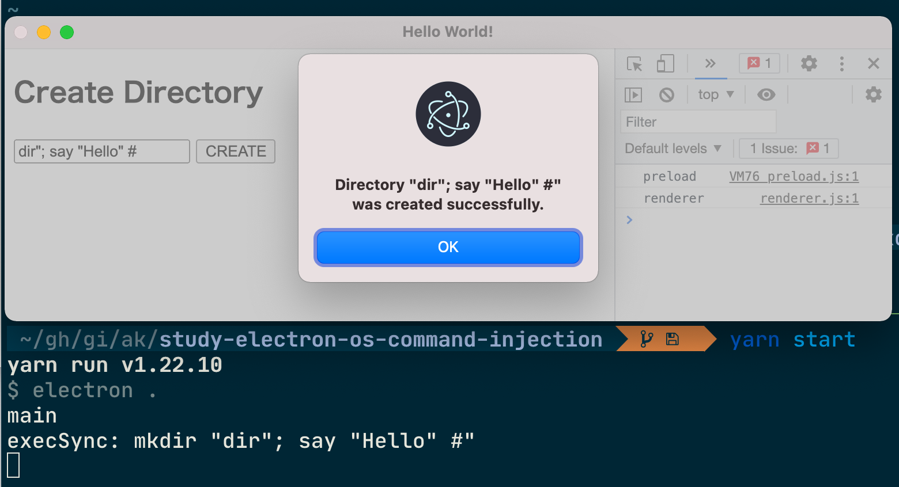

# study-electron-os-command-injection

Electron を使ったアプリ開発のプロジェクトに参加していた時に OS コマンドインジェクションの脆弱性を発見し、指摘・修正した経験がありました。
その時の事例を元に作成したサンプルプロジェクトです。

詳細：
https://zenn.dev/aktriver/articles/2021-08-electron-os-command-injection



## 実行

```sh
yarn install --frozen-lockfile
yarn start
```

`<ディレクトリ名>"; <任意コマンド>#` と入力して `CREATE` をクリックすることで任意コマンドを実行できます。

## 例

### ディレクトリをエクスプローラで開く

Windows の場合：`dir"; start . ||` と入力（多分。試していません…）
Mac の場合：`dir"; open . #` と入力

### スピーカーから音を出す

Mac の場合：`dir"; say "任意の言葉" #` と入力

## 対策

ベストな方法は `execFile`/`execFileSync` を使用することです。

```javascript
const { execFileSync } = require("child_process");

ipcMain.handle("CREATE_NEW_DIRECTORY", (_event, name) => {
  execFileSync("mkdir", [name]);
});
```
